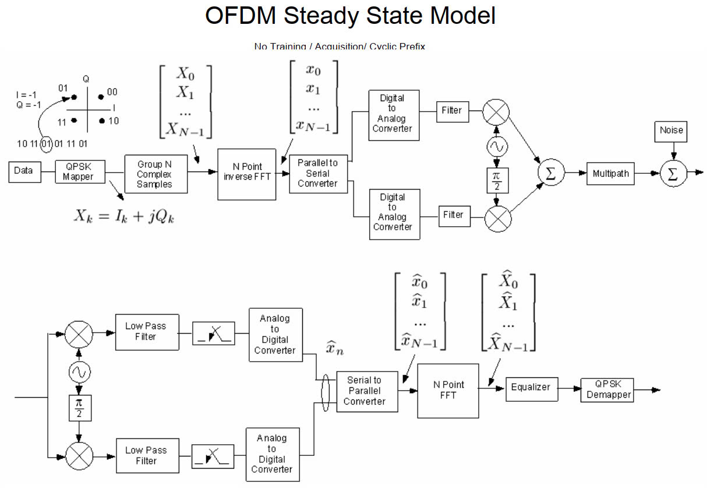

# DSP (Digital Signal Processing)

**BPSK (Binary Phase Shift Keying)**

Binary Phase Modulation

**QAM (Quadrature Amplitude Modulation)**

Quadrature Amplitude Modulation

**SDMA (Space Division Multiple Access)**

Dividing the channel for multiple simultaneous users on the same frequency

**TDMA (Time Division Multiple Access)**

Time Division Multiple Access

**CDMA (Code Division Multiple Access)**

Code Division Multiple Access

**FDMA (Frequency Division Multiple Access)**

Frequency Division Multiple Access.

**OFDM (Orthogonal Frequency Division Multiplexing)**

Orthogonal Frequency Division Multiplexing

**DFT (Discrete Fourier Transform)**

Discrete signal transformation: time domain to frequency domain

**DTFT (Discrete-Time Fourier Transform)**

Convert discrete signal to continuous frequency

**CTFT (Continuous-Time Fourier Transform)**

Convert continuous signal: time domain to frequency domain

**FFT (Fast Fourier Transform)**

Is an algorithm to calculate DFT, dividing the signal into small parts

**IIR (Infinite Impulse Response)**

Filter with infinite impulse response, unstable, difficult to design

**FIR (Finite Impulse Response)**

Filter whose impulse response has a finite length, stable,

**Quantization**

Quantization: Analog signal to number

**Sampling**

Sampling: Continuous to discrete signals.

**Convolution**

Convolution of two signals helps describe the system, important in neural networks (CNN)
