## Lab1

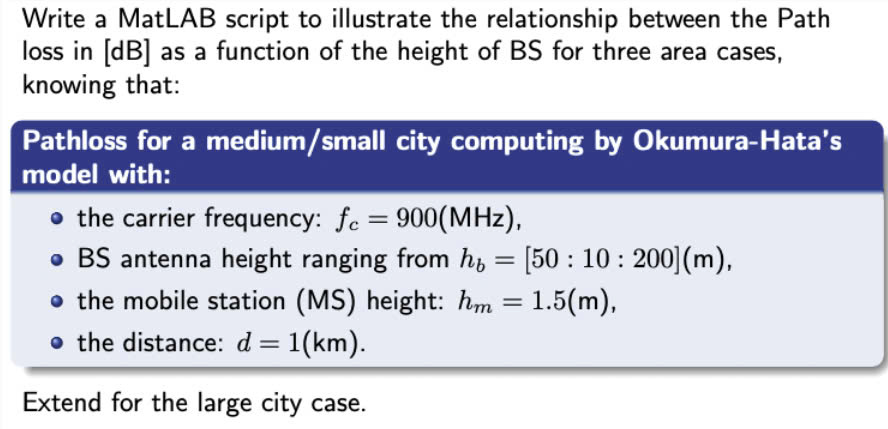

 [Source code](https://github.com/bathanh0309/DSP-Digital-Signal-Processing/blob/main/TTVT/Lab1/Lab1_42_NguyenBaThanh.m)
 
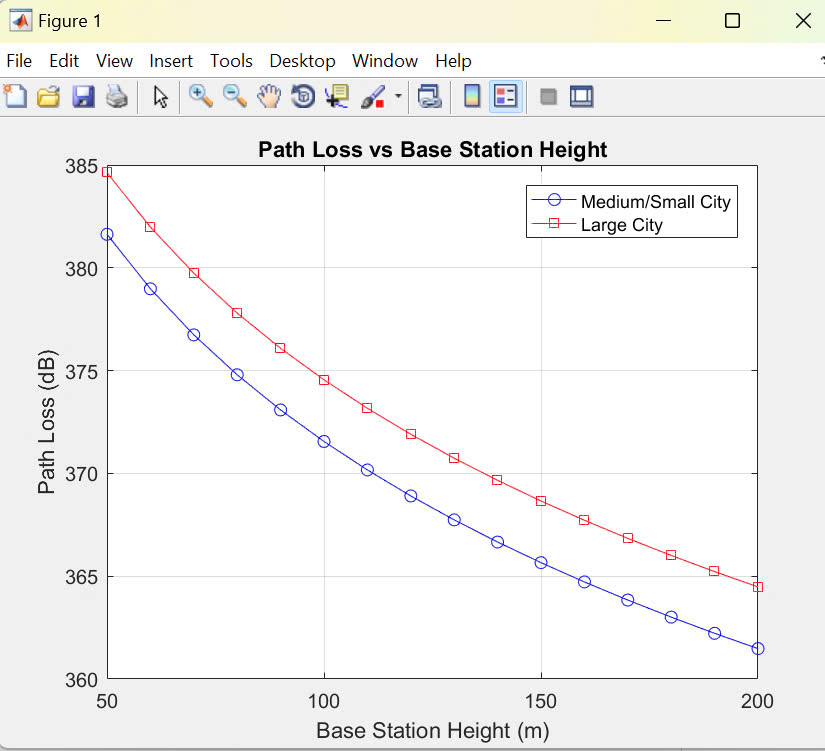

## Lab2
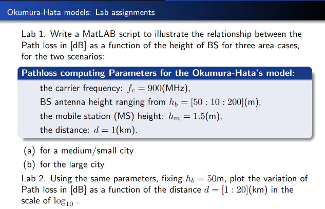

 [Source code](https://github.com/bathanh0309/DSP-Digital-Signal-Processing/blob/main/TTVT/Lab1/Lab2_42_NguyenBaThanh.m)
 
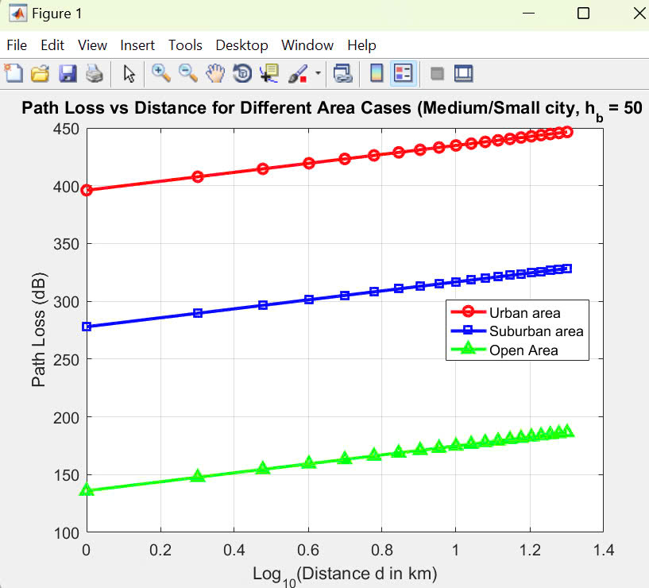

## Lab3
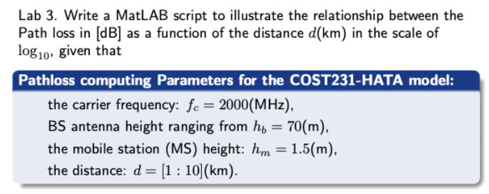

 [Source code](https://github.com/bathanh0309/DSP-Digital-Signal-Processing/blob/main/TTVT/Lab1/Lab3_42_NguyenBaThanh.m)

## Lab4
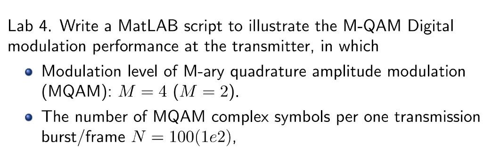

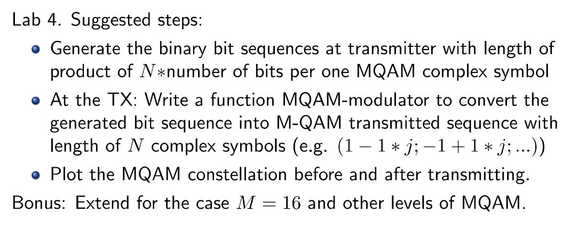

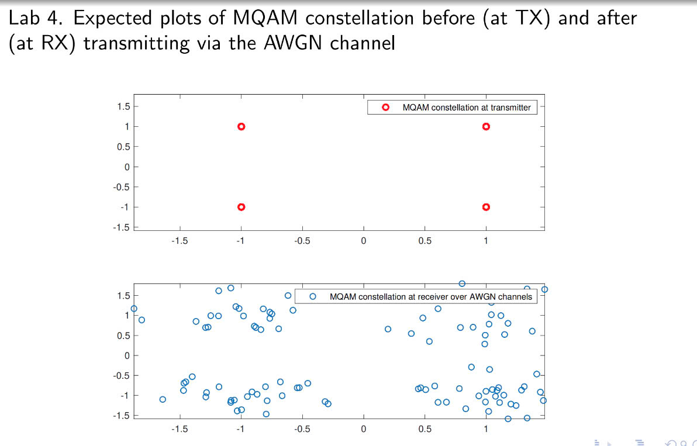

 [Source code](https://github.com/bathanh0309/DSP-Digital-Signal-Processing/blob/main/TTVT/Lab1/Lab4_42_NguyenBaThanh.m)
 
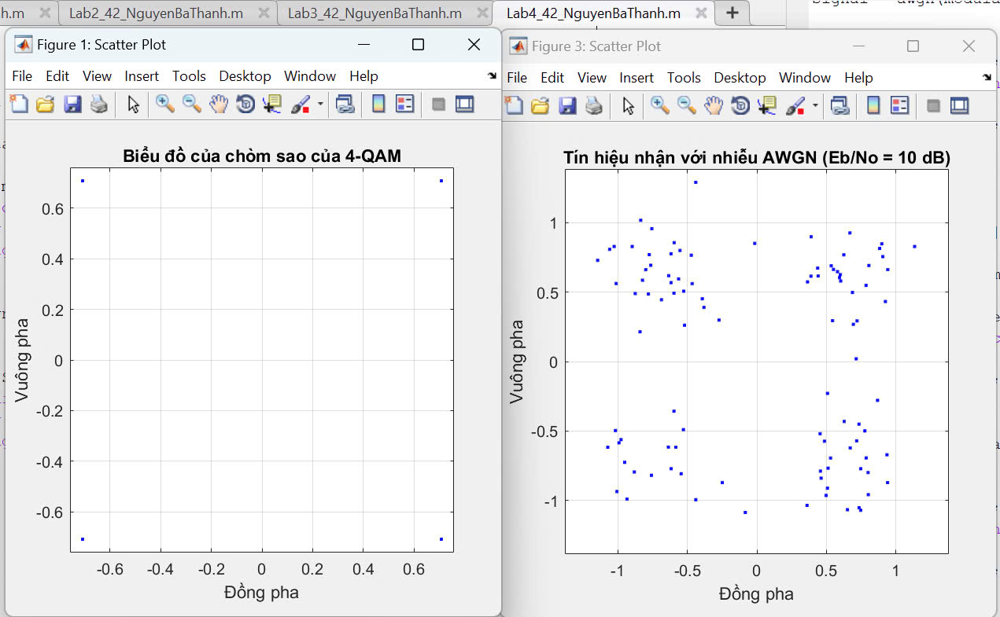

## Lab5
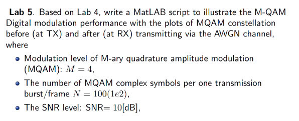

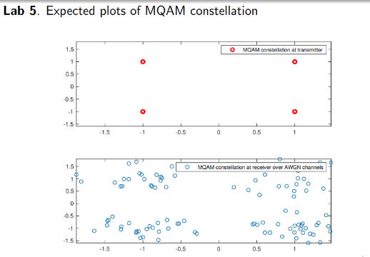

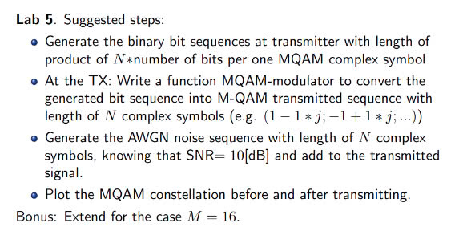

 [Source code](https://github.com/bathanh0309/DSP-Digital-Signal-Processing/blob/main/TTVT/Lab1/Lab5_42_NguyenBaThanh.m)
 
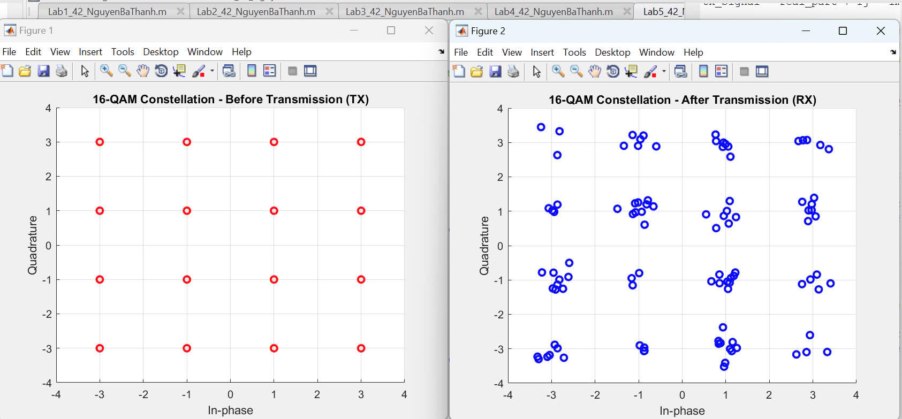

## Lab6
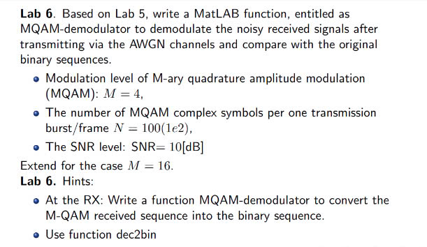

 [Source code](https://github.com/bathanh0309/DSP-Digital-Signal-Processing/blob/main/TTVT/Lab1/Lab6_42_NguyenBaThanh.m)
 

## Lab7
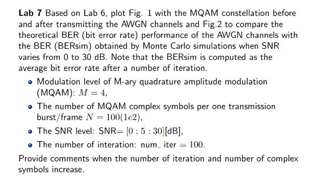

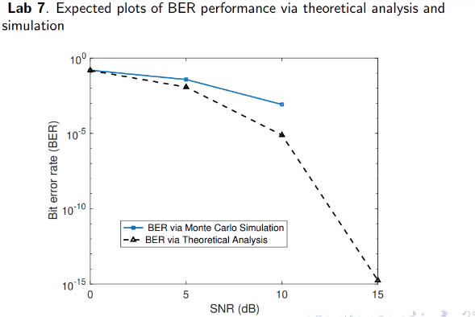

 [Source code](https://github.com/bathanh0309/DSP-Digital-Signal-Processing/blob/main/TTVT/Lab1/Lab7_42_NguyenBaThanh.m)
 
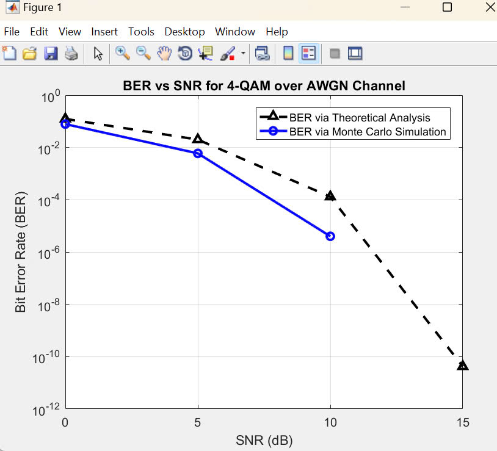

## Lab8
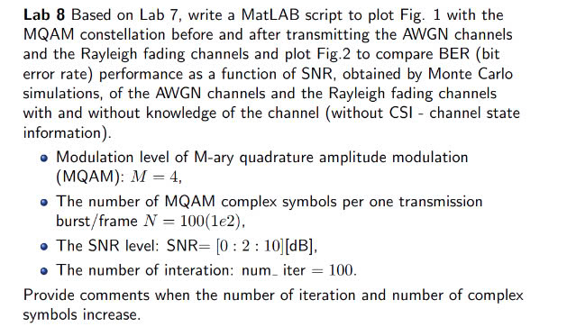

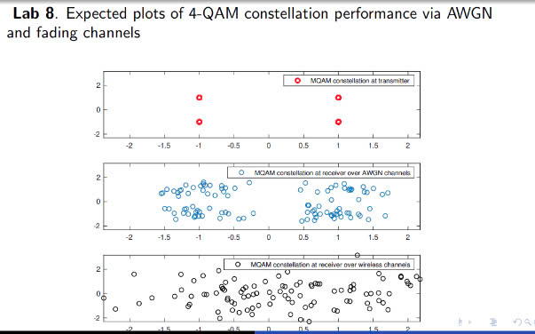

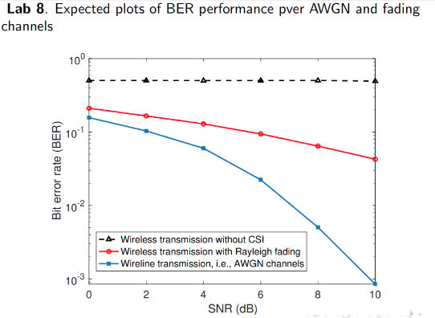

 [Source code](https://github.com/bathanh0309/DSP-Digital-Signal-Processing/blob/main/TTVT/Lab1/Lab8_42_NguyenBaThanh.m)
 
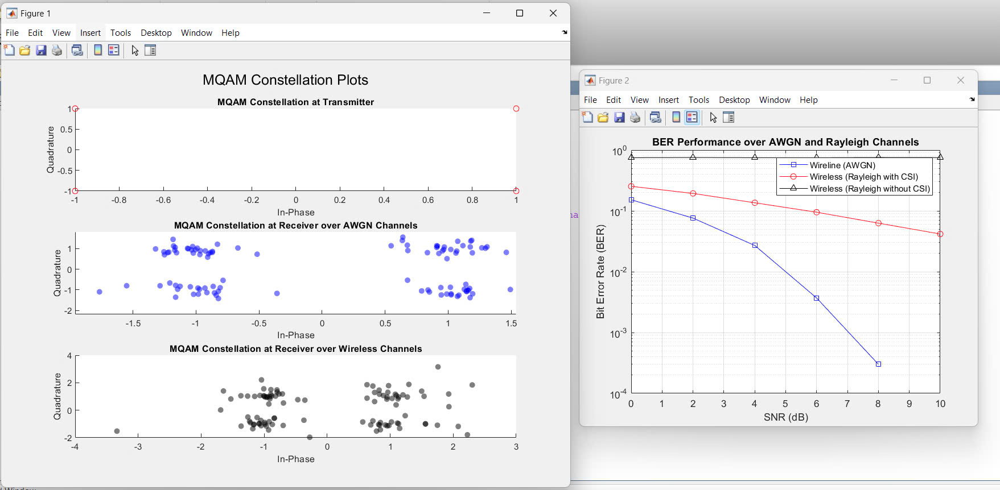

